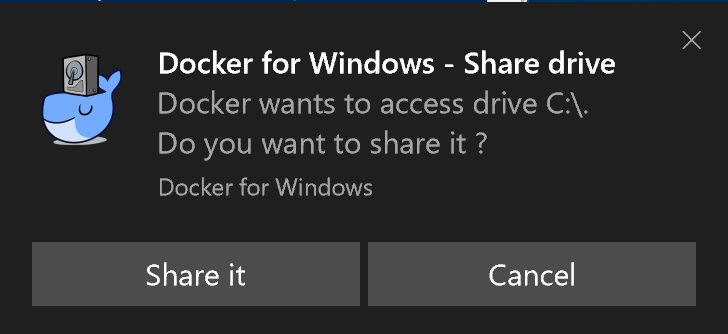

= Metanorma Windows Setup

image:https://ci.appveyor.com/api/projects/status/github/riboseinc/metanorma-windows-setup?branch=master&svg=true["AppVeyor Build", link="https://ci.appveyor.com/project/ribose/metanorma-windows-setup"]
image:https://codeclimate.com/github/riboseinc/metanorma-windows-setup/badges/gpa.svg["Code Climate", link="https://codeclimate.com/github/riboseinc/metanorma-windows-setup"]
image:https://ci.appveyor.com/api/projects/status/vqo2221uwcaov8kx?svg=true["Build Status", link="https://ci.appveyor.com/project/ribose/metanorma-windows-setup"]

== Purpose

This repository provides installation of the
https://github.com/riboseinc/metanorma[Metanorma] publication toolchain
on Windows.

There are two types of installation:

* Docker: allows easier management of dependencies
* Native: better performance

== Requirements

* https://www.microsoft.com[Windows 8+] for native installation
* https://www.microsoft.com[Windows 10] for the "`Docker for Windows`" installation

Older versions may work but are not tested.

== Quick install

=== Open PowerShell with Administrator rights

Right-click on the "`Start`" menu, and click on "`Windows PowerShell (Admin)`".

image::images/windows-powershell-start.png[]

You will be presented with the following alert, click "`Yes`" to start the shell.

image::images/windows-powershell-enable.png[]

=== Native installation

Run the commands as specified:

If you'd like to run via `cmd.exe` (run with Administrator privileges):

[source,sh]
----
bitsadmin /transfer get https://raw.githubusercontent.com/riboseinc/metanorma-windows-setup/master/install.bat %cd%\install.bat & .\install.bat
----

If you'd like to run via PowerShell (again, run with Administrator privileges):

----
(Invoke-WebRequest 'https://raw.githubusercontent.com/riboseinc/metanorma-windows-setup/master/install.bat' -OutFile 'install.bat'); .\install.bat
----

=== Docker installation

Run the commands as specified:

If you'd like to run via `cmd.exe` (run with Administrator privileges):

[source,sh]
----
bitsadmin /transfer get https://raw.githubusercontent.com/riboseinc/metanorma-windows-setup/master/docker.bat %cd%\docker.bat & .\docker.bat
----

If you'd like to run via PowerShell (again, run with Administrator privileges):

----
(Invoke-WebRequest 'https://raw.githubusercontent.com/riboseinc/metanorma-windows-setup/master/docker.bat' -OutFile 'docker.bat'); .\docker.bat
----

== Manual Install

If automatic installation doesn't work for you for some reason, follow steps bellow.

=== Docker install

==== General

Running Metanorma requires installation of the following software:

* "`Docker`" is required to run Metanorma on Windows;
* "`Git`" is recommended for sharing and running the examples;

There are two ways to install prerequisite packages on Windows:

* Via the https://chocolatey.org[Chocolatey] package manager (recommended).
  Chocolatey allows you to mostly automate the install process without
  human input.
* Via manual downloads and installs

==== Install "`Chocolatey`"

You can install Chocolatey with `cmd.exe` or PowerShell.

Let's take the PowerShell method as an example.

NOTE: Refer to detailed steps here: https://chocolatey.org/install

===== Run Chocolatey install script in PowerShell

Inside the PowerShell with Administrator rights, paste the following
commands into it.

[source,sh]
----
Set-ExecutionPolicy Bypass -Scope Process -Force; iex ((New-Object System.Net.WebClient).DownloadString('https://chocolatey.org/install.ps1'))
----

==== Install "`Git`"

We strongly recommend installing "`Git`" using Chocolatey.

===== Install Git using Chocolatey

All you need is to run the following command:

[source,sh]
----
choco install git -y
----

===== Install Git manually

Go to this website to download "`Git for Windows`":

https://git-scm.com/download/win

And install it.

==== Install "`Docker for Windows`"

Again, life is much easier using Chocolatey.

===== Install Docker for Windows using Chocolatey

The following command installs "`Docker for Windows`"

[source,sh]
----
choco install docker-for-windows -y
----

===== Install Docker for Windows manually

. Go to the https://store.docker.com/editions/community/docker-ce-desktop-windows[Docker Store] to download "`Docker for Windows`"

.. While the Docker Store asks you to login before downloading, the link is actually available without needing to authenticate (https://download.docker.com/win/stable/Docker%20for%20Windows%20Installer.exe[download link])
+
image::images/docker-manual-download.png[]

.. Open the downloaded file.
+
image::images/docker-manual-install.png[]

. Allow the install to execute with administrative access
+
image::images/docker-manual-install-allow.png[]

. See the installation progress.
+
image::images/docker-manual-install-process.png[]

. Continue with the default configuration. *DO NOT* select "`Use Windows containers instead of Linux containers`" otherwise the Metanorma container cannot run. It must be run with "`Linux containers`".
+
image::images/docker-manual-install-config.png[]

.. (Luckily, if you have selected this, it is switchable afterwards)

. Installation is completed and a restart is required.
+
image::images/docker-manual-install-finished.png[]

===== Post-install

This section is relevant regardless of which method you used to install
Docker for Windows.

On the first restart, you will asked by Docker to enable Hyper-V and
the Containers service as shown below. This is mandatory for running Docker on Windows.
Click "`OK`" to accept the install and restart, but remember to switch back
to using "`Linux containers`" prior to running Metanorma.

image::images/docker-enable-containers.png[]

After the restart you will see Docker being up as shown below!

image::images/docker-up.png[]

===== Switching Docker to use Linux containers

If you mistakenly enabled "`Windows containers`", you will have to
switch back to "`Linux containers`" to run the Metanorma container.

Otherwise you will be given the dreaded
"`image operating system “linux” cannot be used on this platform`".

. Right click on the docker taskbar icon, and click "`Switch to Linux containers`"

. See the following prompt, click "`Switch`"
+
image::images/docker-switch-to-linux.png[]

. Wait until the docker taskbar icon indicates that docker is up again.

== Verify everything works

=== Special notes for Docker installation

==== Drive sharing with Docker

When running the following commands, you may be prompted to share
your current drive, such as "`C:\`", as shown below. This is necessary
to allow the Metanorma Docker container to read the files in the cloned
directory.

Click "`Share It`" to share the drive with the Metanorma Docker container.

==== Running Docker on Windows within a VM

If you are running Windows via virtualization, you must set your hypervisor
to enable hardware virtualization for the Windows VM.

For example, this screenshot shows you how to enable VT-x in a VM
on VMWare Fusion:

image::images/vmware-enable-vtx.png[]

=== Example: ISO Rice document

==== Clone source

[source,sh]
----
git clone https://github.com/riboseinc/isodoc-rice
cd isodoc-rice
----

==== Run on native installation

[source,sh]
----
make -f Makefile.win clean all
----

==== Run on Docker installation

[source,sh]
----
docker run -v ${pwd}:/metanorma/ ribose/metanorma "metanorma -t iso -x html,xml,doc iso-rice-en.adoc"
----

==== Verify generated files

Then you can open the generated HTML file in PowerShell using Internet Explorer Edge:

[source,sh]
----
Invoke-Item iso-rice-en.html
----

=== Example: UNECE Recommendation 42

==== Clone source

[source,sh]
----
git clone https://github.com/riboseinc/unece-cefact-recommendation-42
cd unece-cefact-recommendation-42
----

==== Run on native installation

[source,sh]
----
make -f Makefile.win clean all
----

==== Run on Docker installation

[source,sh]
----
docker run -v ${pwd}:/metanorma/ ribose/metanorma "metanorma -t cefact -x html,xml,doc unece-cefact-recommendation-42.adoc"
----

==== Verify generated files

Then you can open the generated HTML file in PowerShell using Internet Explorer Edge:

[source,sh]
----
Invoke-Item unece-cefact-recommendation-42.html
----

== Debugging

If you run into any problems, please copy and paste the entire log into a
https://github.com/riboseinc/metanorma-windows-setup/issues/new[new GitHub Issue]
for us.

