= Metanorma Windows Setup

////
image:https://img.shields.io/travis/riboseinc/metanorma-linux-setup/master.svg["Build Status", link="https://travis-ci.com/riboseinc/metanorma-linux-setup"]
image:https://codeclimate.com/github/riboseinc/metanorma-linux-setup/badges/gpa.svg["Code Climate", link="https://codeclimate.com/github/riboseinc/metanorma-linux-setup"]
////

== Purpose

This repository provides installation of the
https://github.com/riboseinc/metanorma[Metanorma] publication toolchain
on Windows.

== Requirements

* https://www.microsoft.com[Windows 10]

Older versions may work but are not tested.

== Installing prerequisites

=== General

Running Metanorma requires installation of the following software:

* "`Docker`" is required to run Metanorma on Windows;
* "`Git`" is recommended for sharing and running the examples;

There are two ways to install prerequisite packages on Windows:

* Via the https://chocolatey.org[Chocolatey] package manager (recommended).
  Chocolatey allows you to mostly automate the install process without
  human input.
* Via manual downloads and installs

=== (Recommended) Install "`Chocolatey`"

You can install Chocolatey with `cmd.exe` or PowerShell.

Let's take the PowerShell method as an example.

NOTE: Refer to detailed steps here: https://chocolatey.org/install

==== Open PowerShell with Administrator rights

Right-click on the "`Start`" menu, and click on "`Windows PowerShell (Admin)`".

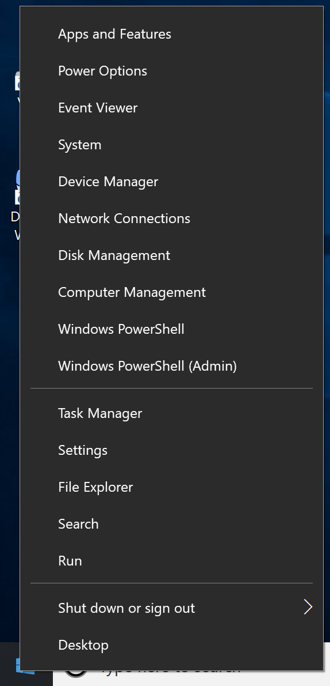

You will be presented with the following alert, click "`Yes`" to start the shell.

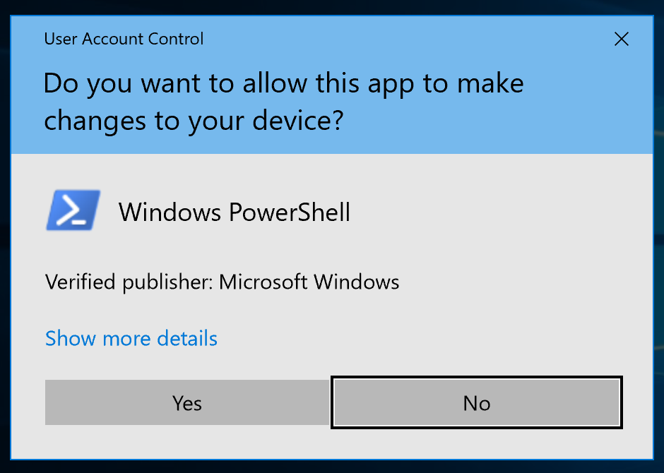

==== Run Chocolatey install script in PowerShell

Inside the PowerShell with Administrator rights, paste the following
commands into it.

[source,sh]
----
Set-ExecutionPolicy Bypass -Scope Process -Force; iex ((New-Object System.Net.WebClient).DownloadString('https://chocolatey.org/install.ps1'))
----

=== Install "`Git`"

We strongly recommend installing "`Git`" using Chocolatey.

==== Install Git using Chocolatey

All you need is to run the following command:

[source,sh]
----
choco install git -y
----

==== Install Git manually

Go to this website to download "`Git for Windows`":

https://git-scm.com/download/win

And install it.

=== Install "`Docker for Windows`"

Again, life is much easier using Chocolatey.

==== Install Docker for Windows using Chocolatey

The following command installs "`Docker for Windows`"

[source,sh]
----
choco install docker-for-windows -y
----

==== Install Docker for Windows manually

. Go to the https://store.docker.com/editions/community/docker-ce-desktop-windows[Docker Store] to download "`Docker for Windows`"

.. While the Docker Store asks you to login before downloading, the link is actually available without needing to authenticate (https://download.docker.com/win/stable/Docker%20for%20Windows%20Installer.exe[download link])
+
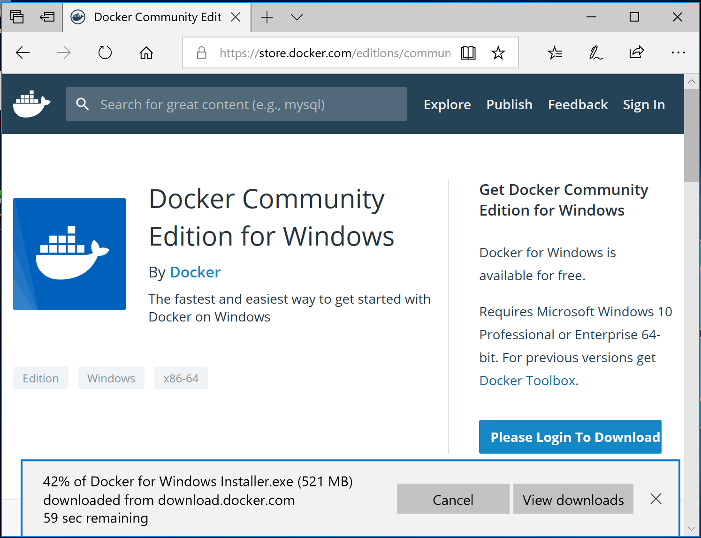

.. Open the downloaded file.
+
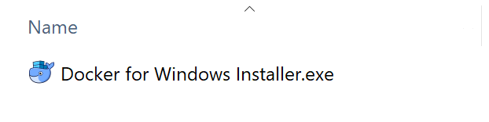

. Allow the install to execute with administrative access
+
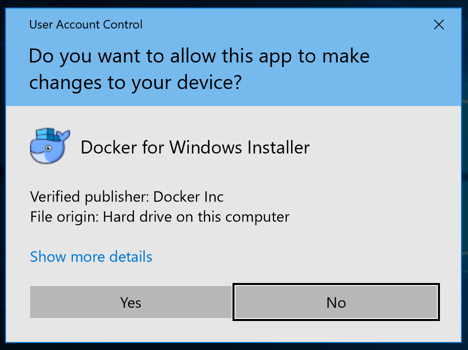

. See the installation progress.
+
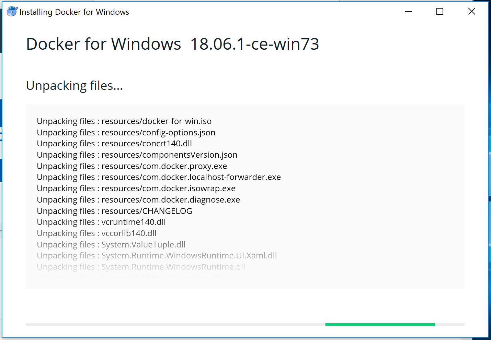

. Continue with the default configuration. *DO NOT* select "`Use Windows containers instead of Linux containers`" otherwise the Metanorma container cannot run. It must be run with "`Linux containers`".
+
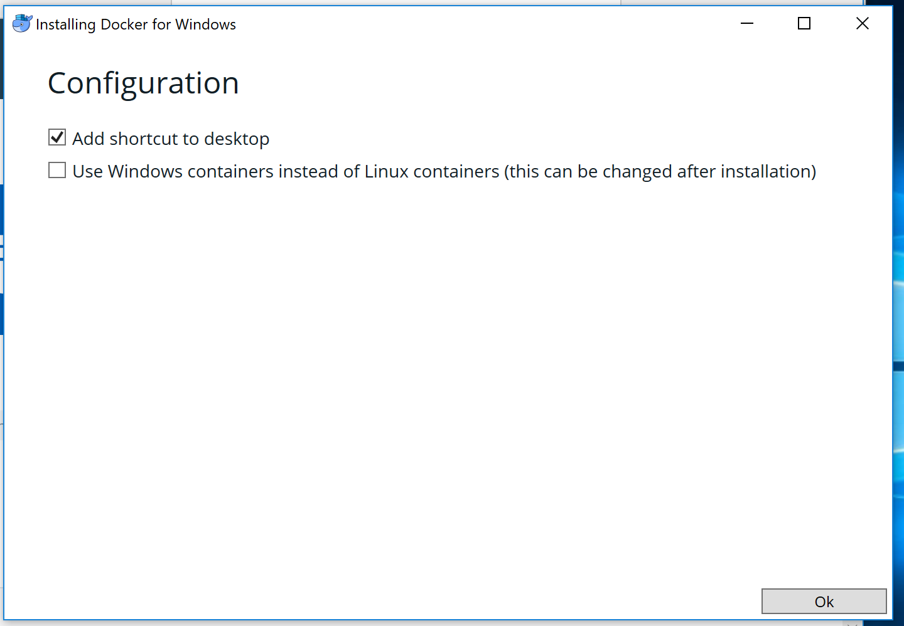

.. (Luckily, if you have selected this, it is switchable afterwards)

. Installation is completed and a restart is required.
+
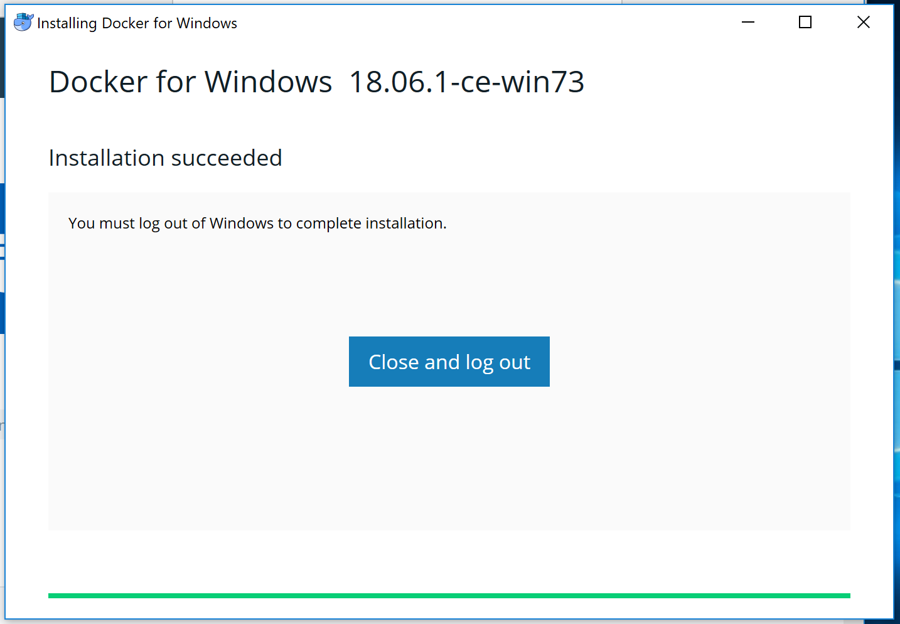

==== Post-install

This section is relevant regardless of which method you used to install
Docker for Windows.

On the first restart, you will asked by Docker to enable Hyper-V and
the Containers service as shown below. This is mandatory for running Docker on Windows.
Click "`OK`" to accept the install and restart, but remember to switch back
to using "`Linux containers`" prior to running Metanorma.

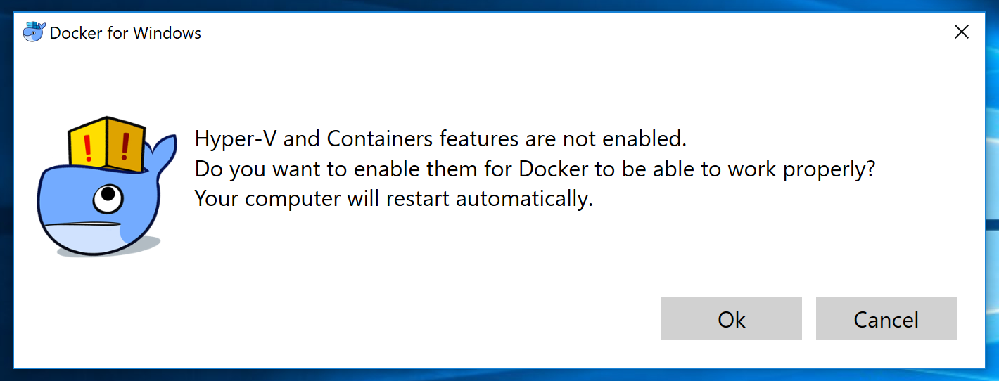

After the restart you will see Docker being up as shown below!

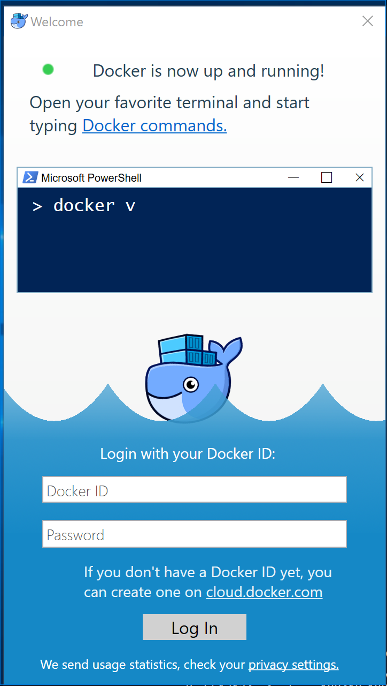

==== Switching Docker to use Linux containers

If you mistakenly enabled "`Windows containers`", you will have to
switch back to "`Linux containers`" to run the Metanorma container.

Otherwise you will be given the dreaded
"`image operating system “linux” cannot be used on this platform`".

. Right click on the docker taskbar icon, and click "`Switch to Linux containers`"

. See the following prompt, click "`Switch`" +
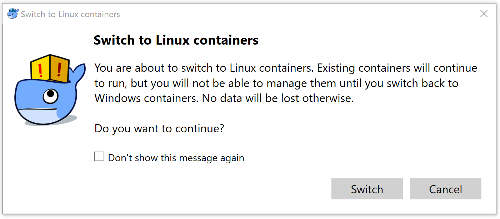

. Wait until the docker taskbar icon indicates that docker is up again.

== Verify everything works

[source,sh]
----
git clone https://github.com/riboseinc/unece-cefact-recommendation-42
cd unece-cefact-recommendation-42
docker run -v "./:/metanorma/" ribose/metanorma "metanorma -t unece -x html,xml,doc unece-cefact-recommendation-42.adoc
----

== Notes for running Windows in a VM (and Docker on it!)

If you are running Windows via virtualization, you must set your hypervisor
to enable hardware virtualization for the Windows VM.

For example, this screenshot shows you how to enable VT-x in a VM
on VMWare Fusion:

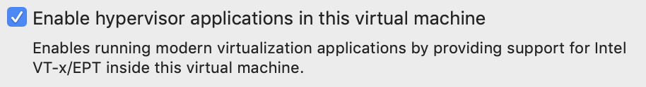

== Debugging

If you run into any problems, please copy and paste the entire log into a
https://github.com/riboseinc/metanorma-windows-setup/issues/new[new GitHub Issue]
for us.

